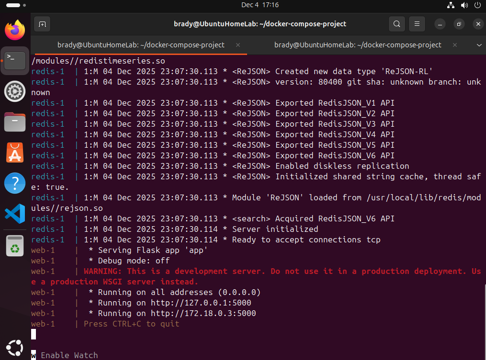
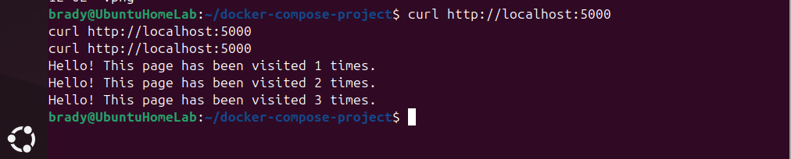
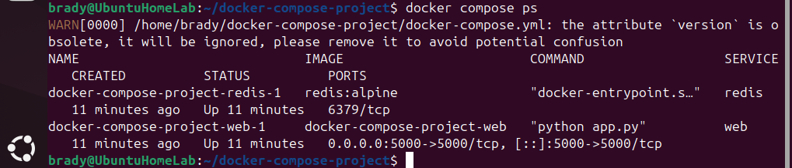
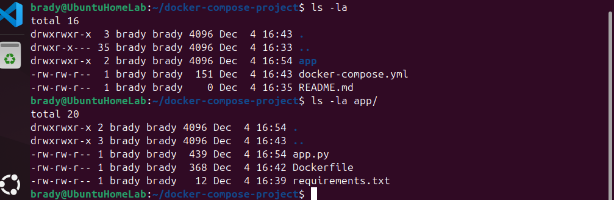

# Docker Compose Multi-Container Application

## Project Overview
A Flask web application with Redis database demonstrating multi-container orchestration using Docker Compose.

## Technologies Used
- Docker
- Docker Compose
- Python (Flask)
- Redis

## What This Project Demonstrates
- Running multiple containers that communicate with each other
- Container networking
- Docker Compose configuration
- Persistent data storage with Redis

## Project Structure
```
docker-compose-project/
├── app/
│   ├── app.py              # Flask application
│   ├── requirements.txt    # Python dependencies
│   └── Dockerfile         # Container build instructions
├── docker-compose.yml     # Multi-container orchestration
├── screenshots/           # Project documentation
└── README.md
```

## How to Run
1. Clone this repository
2. Navigate to project directory: `cd docker-compose-project`
3. Run: `docker compose up --build`
4. Test: `curl http://localhost:5000`
5. Stop: Press Ctrl+C, then run `docker compose down`

## What It Does
The application displays a visit counter that increments with each page refresh. The counter is stored in Redis, demonstrating persistent data storage and inter-container communication.

## Screenshots

### Containers Running


### Testing with curl


### Container Status


### Project Structure


## Date Completed
December 4, 2025
