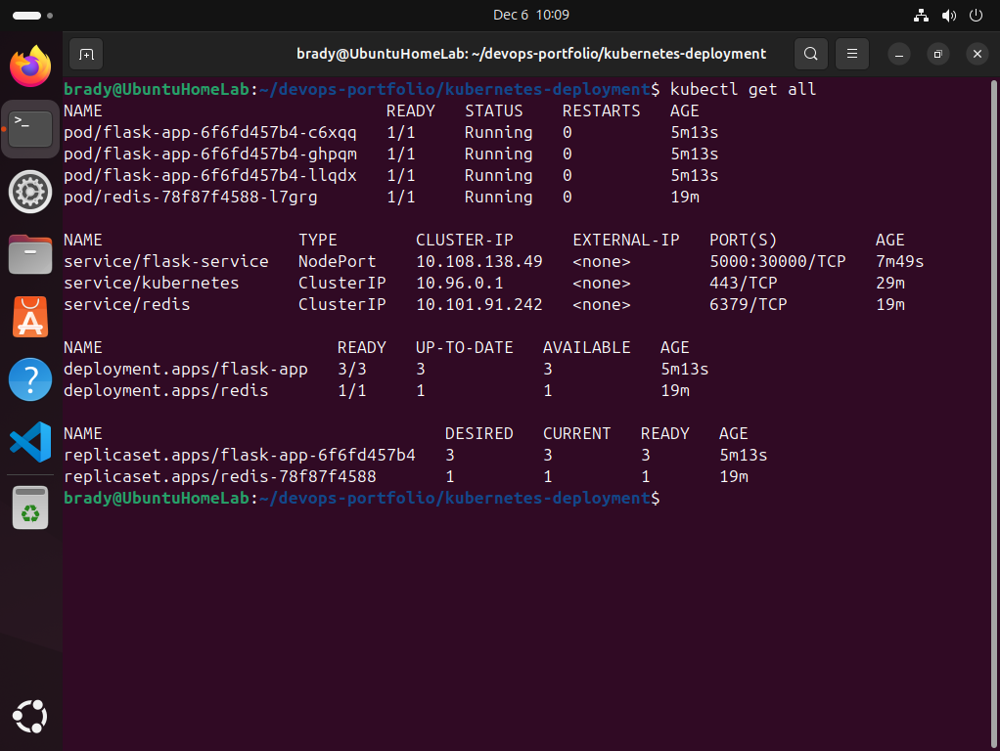
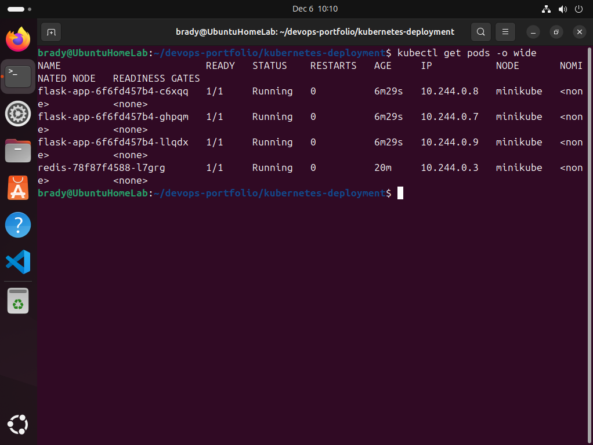
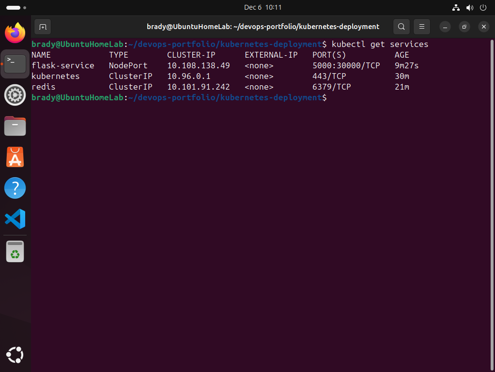

# Kubernetes Deployment - Flask + Redis

## Project Overview
Deployed a multi-container Flask web application with Redis database to Kubernetes using Minikube, demonstrating container orchestration, auto-scaling, and service networking.

## Technologies Used
- Kubernetes (Minikube)
- kubectl
- Docker containers
- Python (Flask)
- Redis
- YAML configuration

## What This Project Demonstrates
- Kubernetes deployments and services
- Container orchestration with replica management
- Pod-to-pod networking
- Load balancing across multiple replicas
- Service discovery in Kubernetes
- Infrastructure as Code with YAML

## Architecture
- **3 Flask app pods** - Web application with automatic load balancing
- **1 Redis pod** - Persistent data storage
- **2 Services** - flask-service (NodePort) and redis (ClusterIP)
- **Auto-healing** - If a pod crashes, Kubernetes restarts it automatically

## Project Structure
```
kubernetes-deployment/
├── flask-deployment.yaml    # Flask app deployment and service
├── redis-deployment.yaml    # Redis deployment and service
└── README.md
```

## How to Deploy
1. Start Minikube: `minikube start`
2. Deploy Redis: `kubectl apply -f redis-deployment.yaml`
3. Deploy Flask: `kubectl apply -f flask-deployment.yaml`
4. Get service URL: `minikube service flask-service --url`
5. Test: `curl $(minikube service flask-service --url)`

## What It Does
The application displays a visit counter that increments with each request. The counter is stored in Redis, demonstrating:
- Multi-pod deployment (3 Flask replicas)
- Inter-service communication (Flask → Redis)
- Load balancing (requests distributed across 3 pods)
- Persistent storage (Redis maintains state)

## Key Kubernetes Commands Used
```bash
kubectl get pods              # View running pods
kubectl get services          # View services
kubectl get all              # View all resources
kubectl logs <pod-name>      # View pod logs
kubectl describe pod <name>  # Detailed pod info
```
## Screenshots

### Cluster Overview


### Testing the Application


### Pod Details


### Services


## Date Completed
December 6, 2025
