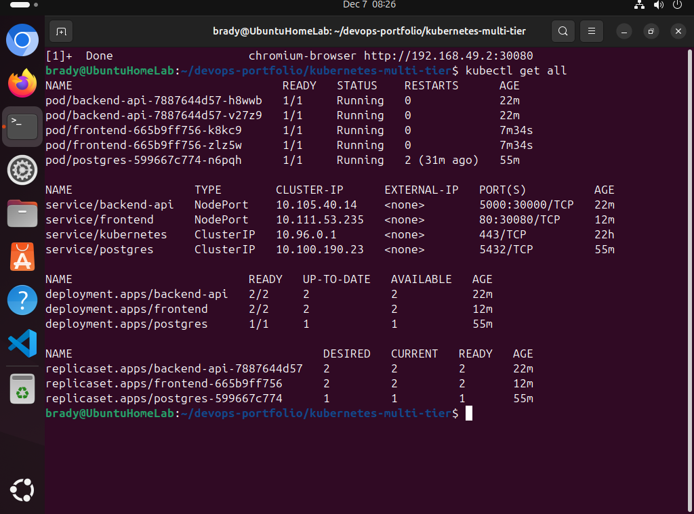
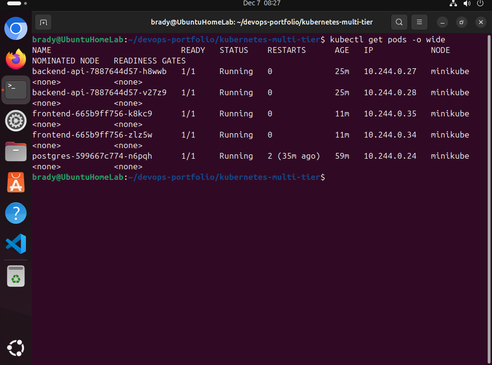
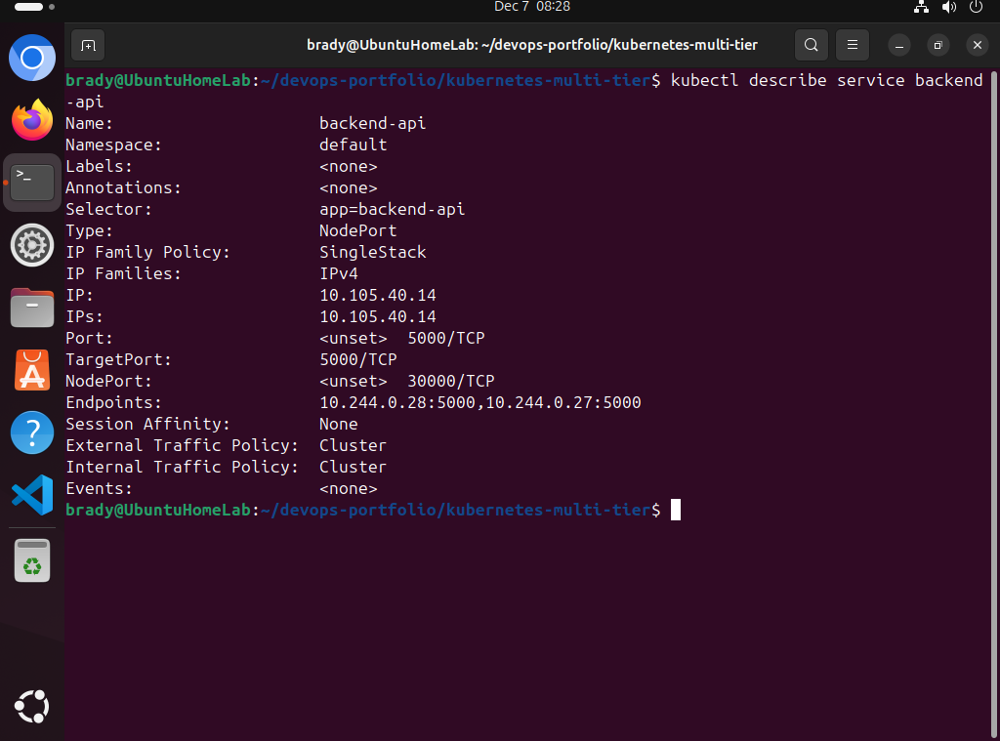
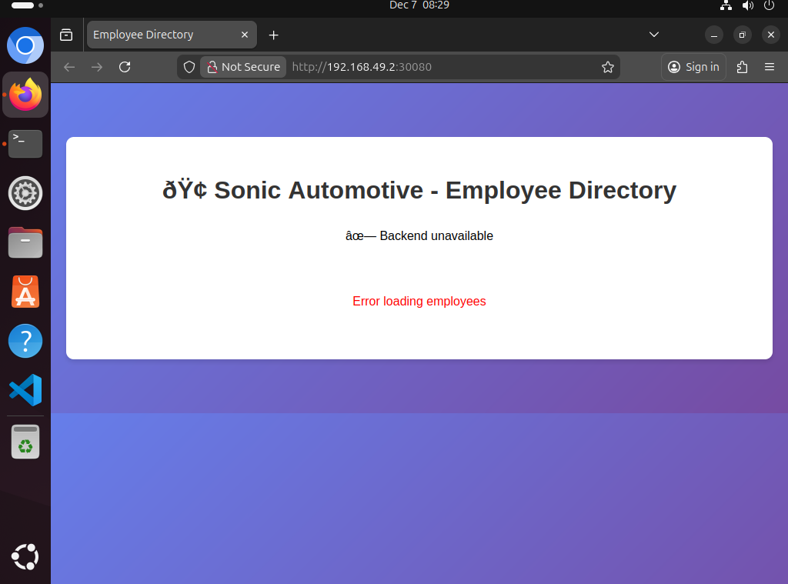
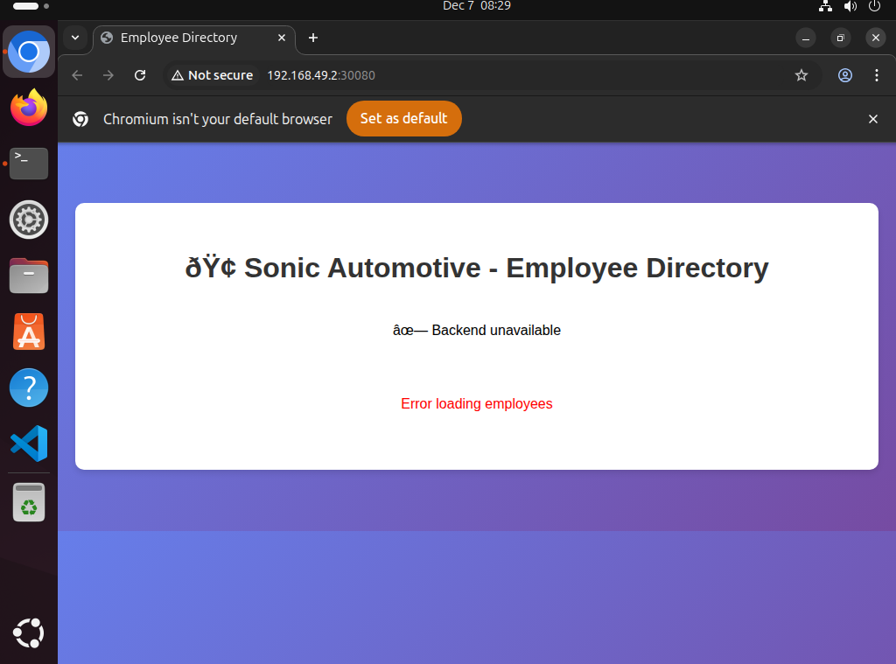

# Kubernetes Multi-Tier Application - Employee Directory

## Project Overview
Deployed a production-style 3-tier application to Kubernetes demonstrating enterprise architecture patterns: frontend (Nginx), backend API (Flask/Python), and database (PostgreSQL).

## Technologies Used
- Kubernetes (Minikube)
- Docker containers
- Python (Flask)
- PostgreSQL
- Nginx
- HTML/CSS/JavaScript
- kubectl

## Architecture

### Three-Tier Design
**Frontend (Presentation Layer)**
- 2 Nginx pods serving HTML/CSS/JavaScript
- Employee directory user interface
- Responsive design with gradient styling

**Backend (Application Layer)**
- 2 Flask API pods for load balancing
- RESTful endpoints: `/api/health`, `/api/employees`
- PostgreSQL database connection and query handling
- Auto-creates database schema and sample data

**Database (Data Layer)**
- 1 PostgreSQL pod
- Stores employee records (name, department, position)
- ConfigMap for database configuration
- Secrets for password management

## What This Demonstrates
- Multi-tier application architecture
- Kubernetes deployments with multiple replicas
- Service networking and discovery
- ConfigMaps and Secrets management
- Database integration
- Load balancing across pods
- RESTful API design
- Horizontal scaling capabilities

## Project Structure
```
kubernetes-multi-tier/
├── postgres-deployment.yaml    # Database deployment with ConfigMap & Secret
├── backend-deployment.yaml     # Flask API deployment & NodePort service
├── frontend-deployment.yaml    # Nginx deployment with HTML ConfigMap
├── screenshots/                # Documentation screenshots
└── README.md
```

## Sample Data
Application includes Sonic Automotive team members:
- Brady Durham - Cloud Engineering - DevOps Engineer
- Phillip Shepherd - Engineering - Software Dev Manager
- Scott Jernigan - Cloud Engineering - Team Lead
- Gabe Jahn - Technology - VP of Technology

## How to Deploy
1. Start Minikube: `minikube start`
2. Deploy database: `kubectl apply -f postgres-deployment.yaml`
3. Deploy backend: `kubectl apply -f backend-deployment.yaml`
4. Deploy frontend: `kubectl apply -f frontend-deployment.yaml`
5. Check status: `kubectl get all`

## Testing the Application

### Backend API Testing (Verified Working)
```bash
# Test from within cluster
kubectl run test-pod --rm -i --tty --image=curlimages/curl -- sh
curl http://backend-api:5000/api/health
curl http://backend-api:5000/api/employees

# Test via NodePort
curl http://192.168.49.2:30000/api/employees
# Returns: [{"department":"Cloud Engineering","id":1,"name":"Brady Durham"...}]
```

## Known Issues & Production Considerations

### CORS Configuration
Currently, the frontend (port 30080) and backend API (port 30000) run on different ports, which triggers browser CORS (Cross-Origin Resource Sharing) security policies. The backend API is fully functional (tested via curl and kubectl), but browser-based frontend access requires CORS headers or production deployment patterns.

**Troubleshooting Performed:**
- Tested in Firefox and Chromium browsers - both show CORS restrictions
- Verified backend API responds correctly via curl (see screenshots)
- Confirmed all pods running and communicating internally
- Issue isolated to browser security policy, not application code

**Production Solutions:**
- Implement Kubernetes Ingress Controller for unified entry point
- Configure CORS headers in Flask backend (`flask-cors` package)
- Deploy behind API Gateway or reverse proxy
- Use service mesh (Istio/Linkerd) for advanced traffic management

**Current Status:**
Backend API is fully functional and tested. All tiers communicate correctly within the cluster. CORS configuration would be implemented during production deployment with proper ingress/gateway setup.

## Key Kubernetes Concepts Applied
- **Pods**: Smallest deployable units (frontend, backend, database)
- **Deployments**: Manage replica sets and rolling updates
- **Services**: Internal (ClusterIP) and external (NodePort) networking
- **ConfigMaps**: Configuration data (database config, HTML files)
- **Secrets**: Sensitive data (database password)
- **Labels & Selectors**: Service discovery and pod organization
- **Multi-replica deployments**: High availability (2 frontend, 2 backend)

## Screenshots

### Complete Application Stack


### Backend API Testing (Working)


### Pod Details


### Service Configuration


### Browser Testing - CORS Issue



## Future Enhancements
- Add Kubernetes Ingress for unified entry point
- Implement persistent volumes for database
- Add horizontal pod autoscaling based on CPU/memory
- Deploy to Azure Kubernetes Service (AKS)
- Add monitoring with Prometheus/Grafana
- Implement CI/CD pipeline for automated deployments

## Date Completed
December 7, 2025
